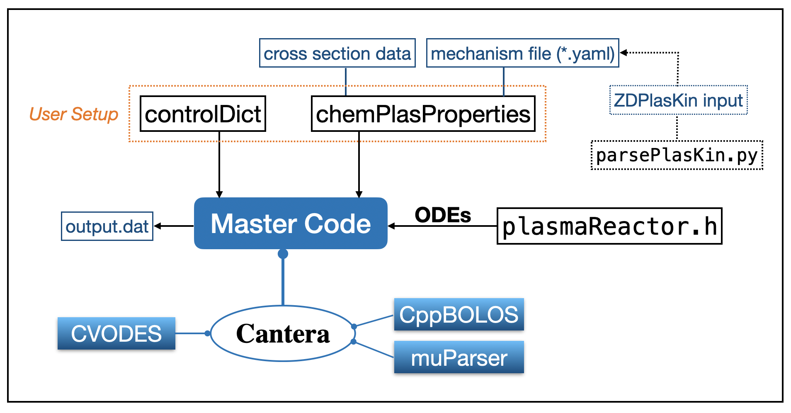

# ChemPlasKin


ChemPlasKin is a free code optimized for zero-dimensional (0D) simulations of neutral gas chemical kinetics coupled with non-equilibrium plasma.

## News
Stay up to date with the latest changes and updates by visiting the [Releases](https://github.com/ShaoX96/ChemPlasKin/releases) page and [watching this repository](https://github.com/ShaoX96/ChemPlasKin/subscription). 

#### Aug 1, 2024
- Update the documentation for clarity.
- Update `CMakeLists.txt` for portable compilation.

#### July 21, 2024
- **Initial Release**: Version 1.0.0 of ChemPlasKin is now available.

## Overview
ChemPlasKin integrates an electron Boltzmann equation solver, [CppBOLOS](https://github.com/ShaoX96/CppBOLOS), with the open-source combustion library [Cantera](https://cantera.org) at the source code level.
ChemPlasKin enables the calculation of species concentration and gas temperature over time within a unified gas-plasma framework.
This approach enables accurate modeling of both chemical thermal effects and plasma-induced heating, including fast gas heating and slower vibrational-translational relaxation processes.

Check our [paper](https://doi.org/10.1016/j.jaecs.2024.100280) and cite:

Shao, X., Lacoste, D. A., & Im, H. G. (2024). ChemPlasKin: A general-purpose program for unified gas and plasma kinetics simulations. Applications in Energy and Combustion Science, 100280. https://doi.org/10.1016/j.jaecs.2024.100280

## Key Features
- **Unified ODE system**: neutral gas and plasma kinetics are solved together in a single ODE system
- **Versatility**: Suitable for plasma assisted combustion (PAC) and plasma assisted fuel reforming.
- **Compatibility**: Maintains compatibility with Bolsig+ cross-section input format and ZDPlasKin input mechanism.
- **High Performance**: Written in pure C++, at least 3x faster than ZDPlasKin + Cantera/CHEMKIN method.
- **Heat Loss model**: Designed for nanosecond pulsed discharges in pin-pin electrode configurations.

### Code architecture


## Getting Started
This section provides details on how to modify the Cantera source code and compile it for the usage of ChemPlasKin. 

1. **Prepare working directories**: (eg.`~/Destop/`)
   
   ```sh
   cd ~/Desktop
   mkdir ChemPlasKinProject
   cd ChemPlasKinProject
   ```

2. **Clone the Repositories**
   
   ```sh
   git clone --recursive https://github.com/Cantera/cantera.git
   git clone https://github.com/ShaoX96/ChemPlasKin.git
   ```
   
   Now under `ChemPlasKinProject/` you should have `cantera/` and `ChemPlasKin/`.


3. **Test [Compiling Cantera from Source](https://cantera.org/install/compiling-install.html#sec-compiling)**:  
   You should be familiar with [Compiling Cantera from Source](https://cantera.org/install/compiling-install.html#sec-compiling).
   A Conda environment is recommended for [Compilation Requirements](https://cantera.org/compiling/compilation-reqs.html#sec-conda). For self-containedness and simplicity, a conda environment `ct-CPK`
   can be created and activated by running (make sure you have installed 
   conda, test by running `conda --version`):
   ```sh 
   conda env create -f ChemPlasKin/environment.yaml
   conda activate ct-CPK
   ```
   Now you should be able to compile the original Cantera source before making any modifications to it:
   
   ```sh
   cd cantera
   git checkout 3.0
   scons build
   ```
   You will see "Compilation completed successfully" message upon successful compilation.


4. **Obtain external libraries for ChemPlasKin**:
- Create a new branch for Cantera and check (recommended)
  
  ```sh
  git checkout -b for_chemplaskin
  git branch
  ```
  
- Fetch the source code of [CppBOLOS](https://github.com/ShaoX96/CppBOLOS) and [muParser](https://beltoforion.de/en/muparser/) and put them under `cantera/ext/bolos/` and `cantera/ext/muparser/`, respectively.
  
  ```sh
  cd ext
  git clone https://github.com/ShaoX96/CppBOLOS.git
  mv CppBOLOS bolos
  git clone https://github.com/beltoforion/muparser.git
  ```

5. **Update `ext/SConscript`**: 
   
   ```sh
   cd ..
   cp ../ChemPlasKin/ext/SConscript ext/SConscript
   ```

6. **Extend Cantera kinetics module**
   
   ```sh
   cp ../ChemPlasKin/include/kinetics/*.h include/cantera/kinetics/
   cp ../ChemPlasKin/include/base/Solution.h include/cantera/base/
   cp ../ChemPlasKin/src/kinetics/*.cpp src/kinetics/
   cp ../ChemPlasKin/src/base/Solution.cpp src/base/
   ```

7. **Stage and Commit Changes (optional)**
   
   Make sure you have set your email and name in your Git configuration.
   
   ```sh
   git config --global user.email "your.email@example.com"
   git config --global user.name "Your Name"
   ```
   
   Then commit your changes, for example: 
   
   ```sh
   git add .
   git commit -m "Modify Cantera source for ChemPlasKin usage."
   ```

8. **Compile new library**
   
   ```sh
   scons build
   ```
   
   The compiled Cantera library is under `cantera/build/lib`. It is linked to ChemPlasKin through `ChemPlasKin/CMakeLists.txt`. 
   For example on macOS (no action needed):
   
   ```sh
   link_directories("../cantera/build/lib")
   target_link_libraries(ChemPlasKin PRIVATE cantera_shared ${ACCELERATE_FRAMEWORK} Threads::Threads)
   ```

9. **Build ChemPlasKin**
   
   Ensure CMake and Make are properly installed and configured on your system (by testing `cmake --version
   `, `make --version`) and compile the code:

   ```sh
   cd ../ChemPlasKin
   mkdir build
   cd build
   cmake ..
   make
   ```

10. **Run an example**:
    Use `-case` to specify the running case path where `controlDict` and `chemPlasProperties` files are located. Use optional `-log` flag to control log level: `NONE`, `WARNING`, `INFO`(default) , or `DEBUG`. 
    
    ```sh
    ./ChemPlasKin -case ../examples/H2O2He -log DEBUG
    ```

11. **Check results**:
    
    ```sh
    cd ../examples/H2O2He
    python plot.py
    ```
**General Note**:
If you face difficulties during the compilation process, seek assistance from ChatGPT. It's your best friend.


## Data input
Two input data files, cross section and reaction mechanism, are needed, as specified in `chemPlasProperties`:

```sh
csDataFile       "<case>/../../data/LXCat/bolsigdb_H2O2HE.dat";
mechFile         "<case>/../../data/PAC_kinetics/ZDPlasKin_kinetics/Mao-H2O2He/H2O2HE_Mao.yaml";
```

The `data/` directory contains:

- `LXCat/`: cross section data in [LXCat](https://nl.lxcat.net/home/) format for CppBOLOS
- `PAC_kinetics/`: unified gas-plasma mechanism files in YAML format

An optional parser tool, `parsePlasKin.py`, is available to convert ZDPlasKin input mechanism files 
into the human-readable YAML format automatically.

```sh
cd ChemPlasKin/data/PAC_kinetics/ZDPlasKin_kinetics/kineticsParser
python parsePlasKin.py --input "plasmaH2O2.inp" --output "parsedPlasKin.yaml"
```

## Donation and support
To support ChemPlasKin and its maintenance, please consider donating via [](https://www.buymeacoffee.com/shaox)

## Acknowledgments
ChemPlasKin uses the Cantera chemical kinetics software, which is developed and maintained by the Cantera Developers. Cantera is an open-source suite of tools for problems involving chemical kinetics, thermodynamics, and transport processes. More information about Cantera can be found at [cantera.org](https://cantera.org).

ChemPlasKin project is funded by Computational Reacting Flow Laboratory ([CRFL](https://crfl.kaust.edu.sa)) led by Professor [Hong G. Im](https://www.kaust.edu.sa/en/study/faculty/hong-im) at 
King Abdullah University of Science and Technology ([KAUST](https://www.kaust.edu.sa/en/)), Thuwal 23955-6900, Saudi Arabia.

## License
ChemPlasKin is open-sourced under the [LGPLv2 License](https://www.gnu.org/licenses/old-licenses/lgpl-2.0.html).

### Using Cantera
ChemPlasKin integrates Cantera for handling detailed chemistry-plasma kinetics. 
Users are advised that Cantera is distributed under its own license terms.

## Links
- [ChemPlasKin paper](https://doi.org/10.1016/j.jaecs.2024.100280)
- [CppBOLOS GitHub](https://github.com/ShaoX96/CppBOLOS)
- Bolsig+ Reference Paper: [G. J. M. Hagelaar and L. C. Pitchford, "Solving the Boltzmann equation to obtain electron transport coefficients and rate coefficients for fluid models", Plasma Sources Science and Technology, 2005](https://iopscience.iop.org/article/10.1088/0963-0252/14/4/011)

## Disclaimer

ChemPlasKin is an independent project that incorporates the Cantera software library. Any issues, bugs, or vulnerabilities found in ChemPlasKin do not necessarily relate to the Cantera software itself.